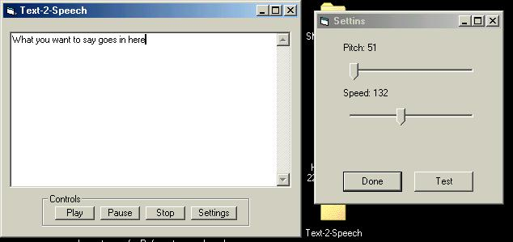



## Microsoft Direct Text\-to\-Speech

### Description

This is a Simple text-to-speech program that uses microsoft direct text-to-speech.

this example teaches you

1. How to make text-to-speech speek

2. how to alter the pitch and speed of the voice

plz keep in mind, this is my first submission
 
### More Info
 

             |
---                |---
**Submitted On**   |2002-05-16 03:43:52
**By**             |[o0x0o\_overload\_o0x0o](https://github.com/Planet-Source-Code/PSCIndex/blob/master/ByAuthor/o0x0o-overload-o0x0o.md)
**Level**          |Beginner
**User Rating**    |4.5 (18 globes from 4 users)
**Compatibility**  |VB 6\.0
**Category**       |[Miscellaneous](https://github.com/Planet-Source-Code/PSCIndex/blob/master/ByCategory/miscellaneous__1-1.md)
**World**          |[Visual Basic](https://github.com/Planet-Source-Code/PSCIndex/blob/master/ByWorld/visual-basic.md)
**Archive File**   |[Microsoft\_836775152002\.zip](https://github.com/Planet-Source-Code/o0x0o-overload-o0x0o-microsoft-direct-text-to-speech__1-34836/archive/master.zip)

